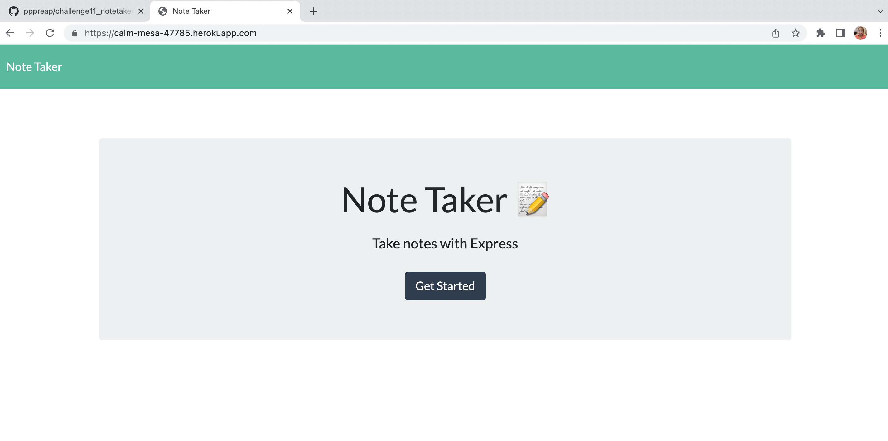
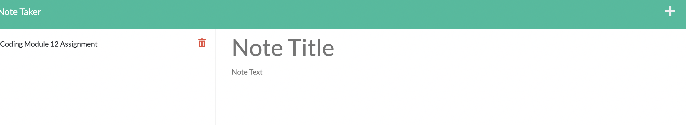
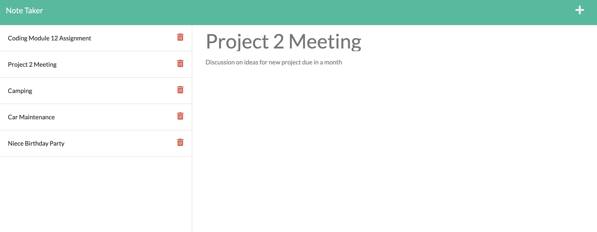
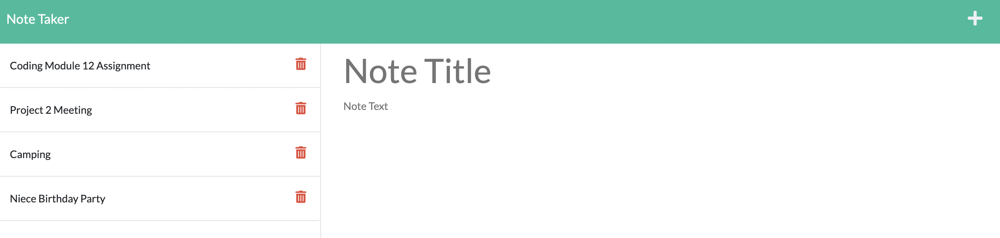

# Module 11 Challenge : Note Taker 
Using Node.js and Express.js, an note application will be created that allow users to post save and post notes. It will help the user organize their tasks. The front end code has been provided and only the backend code need to be completed to make this note application. This application will be deploy in Heroku: [Link to Note Taker Application](https://calm-mesa-47785.herokuapp.com/).

# User Story 

As a small business owner,
the user wants to be able to write and save notes in an application.
This will effectively help them organize their thoughts and keep track of tasks that needs to be completed.

## Criteria

**Install npm, express.js**

**Technologies Used: Node.js, Express.js, npm**

WHEN the user **open the Note Taker**
THEN the user is **presented with a landing page with a link to a notes page**

WHEN the user **click on the link to the notes page**
THEN the user is **presented with a page with existing notes listed in the left-hand column, plus empty fields to enter a new note title and the note’s text in the right-hand column**

WHEN the user **enter a new note title and the note’s text**
THEN a **Save icon appears in the navigation at the top of the page**

WHEN the user **click on the Save icon**
THEN the **new note entered is saved and appears in the left-hand column with the other existing notes**

WHEN the user **click on an existing note in the list in the left-hand column**
THEN that **note appears in the right-hand column**

WHEN the user **click on the Write icon in the navigation at the top of the page**
THEN the user  **presented with empty fields to enter a new note title and the note’s text in the right-hand column**

### Assets
These are images of the working application: create notes, save notes, view notes, and delete notes.

#### Links
[Github Repository](https://github.com/pppreap/challenge11_notetaker) --> : https://github.com/pppreap/challenge11_notetaker
///
[Link to App](https://calm-mesa-47785.herokuapp.com/) ---> :  https://calm-mesa-47785.herokuapp.com/

#### Credits/Licenses
Starter Code: Michigan State University Full Stack Development Coding Program. //
[CSS Frameworks]: Bootstrap The source code is licensed MIT. (https://getbootstrap.com/) //
[Icons](https://fontawesome.com/) //
 Insomnia for testing  //
 Heroku for Application deployment

